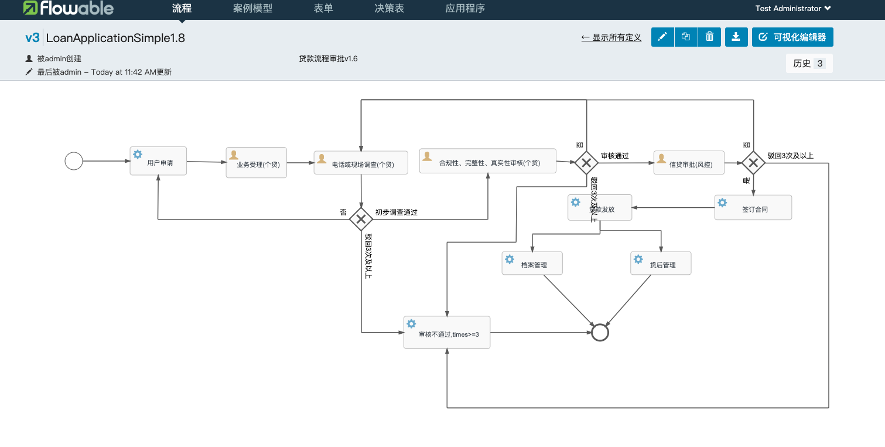
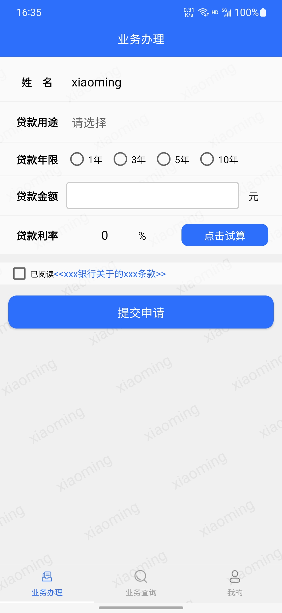
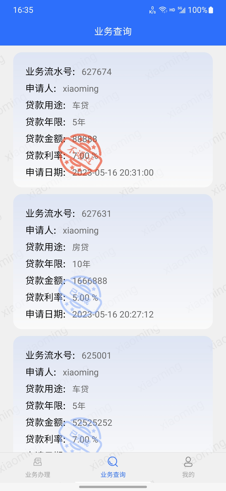
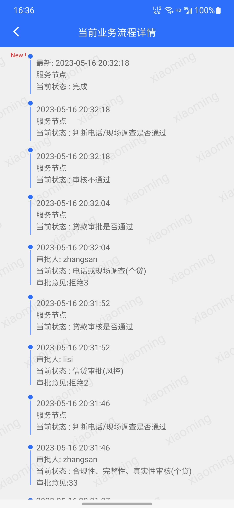
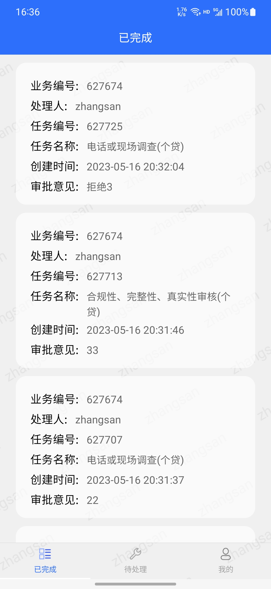

## 背景
- 目前用户办理贷款业务只支持线下办理，业务量比较大、审批流程比较耗时、成本比较高
- 投产后用户可以通过平台进行线上办理贷款业务。审核人员可以线上按流程及时审核业务

## 目标
- 客户可通过线上办理业务，获取该业务的贷款利率，可以及时查看业务状态、跟踪业务进度等信息
- 个贷中心、风控中心的审核人员可以查看已完成和进行中的任务，可以及时处理进行中的业务。审核不通过的业务超过3次(包括3次)的进行驳回。
---
# 总体架构
## 服务端:
采用spring boot作为总体框架，redis缓存用户信息、mybatis负责数据持久化、
drools负责匹配用户贷款利率、flowable管理工作流、rocketmq转发用户办理业务申请，并引入consul和Gateway。
#### 流程图

## Android移动端：
整个项目使用MVP架构，导航栏使用TabLayout+ViewPager2+Fragment，网络请求部分则使用的是Retrofit+RxJava,列表展示使用RecyclerView+SmartRefreshLayout，图片加载使用的是Glide等

### android效果图

用户端页面效果图

业务员操作界面效果图

